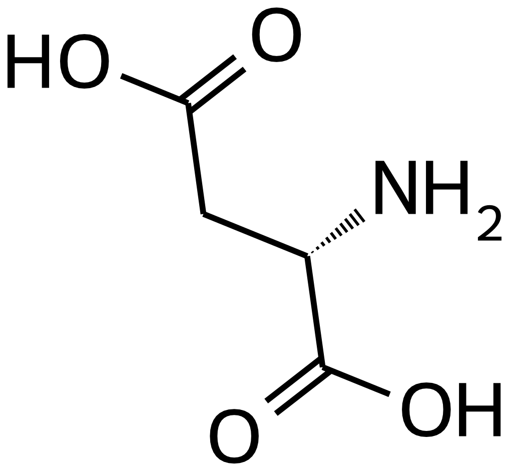
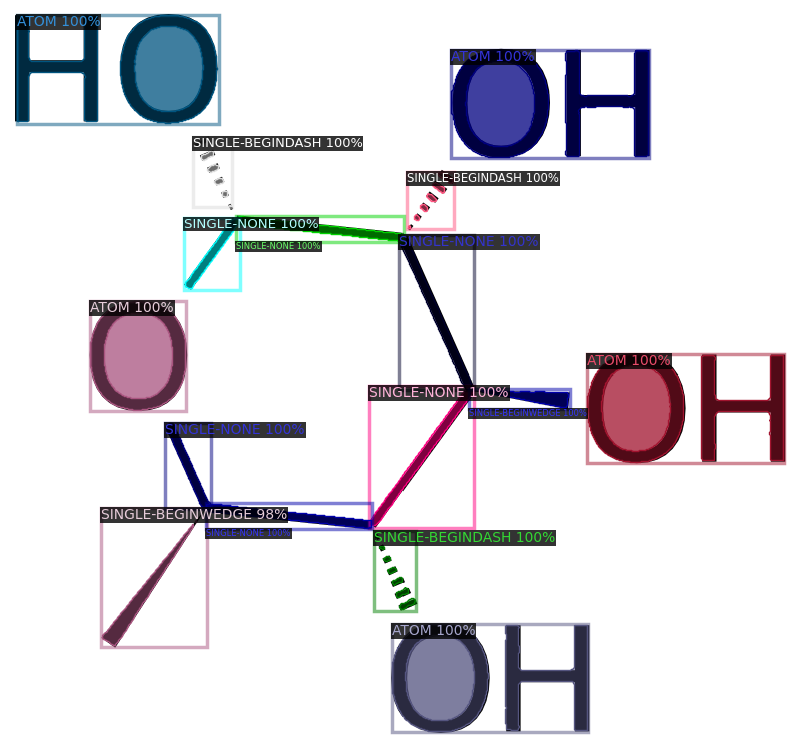

# SMILES Instance Segmentation

This project trains a deep learning model to perform instance segmentation on molecular structure diagrams, detecting and segmenting individual chemical bonds and atoms from rendered SMILES notation.

## Overview

The project consists of two main components:

1. **Synthetic Dataset Generation** - Generates a labeled dataset of molecular structure diagrams from SMILES notation with various rendering parameters (rotation, size, font, bond widths). [Details](#smiles-rendering)
2. **Model Training and Inference** - Trains a Mask R-CNN model using Detectron2 to perform instance segmentation on molecular structures. [Details](./segmentation/README.md)

## Examples

### Input Molecular Structures


### Segmentation Results

Checkout the images directory for more examples.



## Installation & Usage

Install
```bash
uv sync
```

Generate a synthetic dataset:
```bash
uv run python rendering/generate_dataset.py
```

Train the segmentation model:
```bash
uv run python segmentation/train.py
```

Run predictions on test images:
```bash
uv run python segmentation/predict.py
```


## Synthetic Dataset Generation

The main entry file is `generate_dataset.py`. 
To create a sample the following steps are performed:

1. Choose a SMILES pattern and sample rendering options, i.e. line width
2. Use RDKit to generate an SVG file
3. Flatten svg path objects to polygons 
4. Crop and scale the image
5. Extract segmentations masks and class labels from the SVG
6. Convert the SVG into a PNG