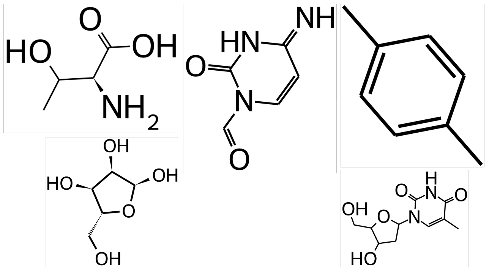

# SMILES Instance Segmentation


This project trains a deep learning model to perform instance segmentation on molecular structure diagrams, detecting and segmenting individual chemical bonds and atoms from rendered SMILES notation.

## 📌 Project Overview

The project consists of two main components:

1. **Synthetic Dataset Generation** - Generates a labeled dataset of molecular structure diagrams from SMILES notation with various rendering parameters (rotation, size, font, bond widths). 
2. **Model Training and Inference** - Trains a Mask R-CNN model using Detectron2 to perform instance segmentation on molecular structures. 


## 🚀 Installation & Usage

Ensure you have uv installed, then synchronize the environment:
```bash
uv sync
```

Generate a synthetic dataset:
```bash
uv run python rendering/generate_dataset.py
```

Train the segmentation model:
```bash
uv run python segmentation/train.py
```

Run predictions on unseen images:
```bash
uv run python segmentation/predict.py
```


## 🧪 Synthetic Dataset Generation

The main entry file is `rendering/generate_dataset.py`. 
To create a sample the following steps are performed:

1. Choose a SMILES pattern and sample rendering options, i.e. line width
2. Use RDKit to generate an SVG file
3. Flatten svg path objects to polygons 
4. Crop and scale the image
5. Extract segmentations masks and class labels from the SVG
6. Convert the SVG into a PNG


Note that there are currently 6 classes:

- **SINGLE-NONE**: Single chemical bonds (plain lines)
- **DOUBLE-NONE**: Double chemical bonds, shown as two parallel lines
- **ATOM**: Individual atom symbols (e.g., C, O, N) 
- **SINGLE-BEGINDASH**: Single bonds rendered with dashed lines,  indicating stereochemistry
- **SINGLE-BEGINWEDGE**: Single bonds rendered with a wedge, representing 3D orientation (out of plane)
- **AROMATIC-NONE**: Aromatic bonds, depicted as alternating single/double bonds


**Example molecules:**



## 🧠 Model Training and Inference

The code for training and inference is inside the `segmentation` directory.
We utilize the Detectron2 library. 
Molecular diagrams present unique challenges compared to natural images, specifically regarding fine-line features.

**Key Findings**
- **Resultion matters:**: Too small input sizes cause thin lines (like dashed wedge bonds) to disappear within the feature extraction backbone. Increasing the input resolution was critical for maintaining feature signal.
- **PointRend Enhancement**: We utilized the [PointRend](https://github.com/facebookresearch/detectron2/tree/main/projects/PointRend) module. resulting in significantly "crisper" segmentation boundaries.


There are many parameters that influence the training and thus the final model.
I ended up using a ResNet50 backbone because there are pretrained model weights available for the PointRend variant.
I trained for 1000 iterations which took about 15mins on a NVIDIA A100.
The results look quite decent. Some example predictions can be seen inside the `images` directory.