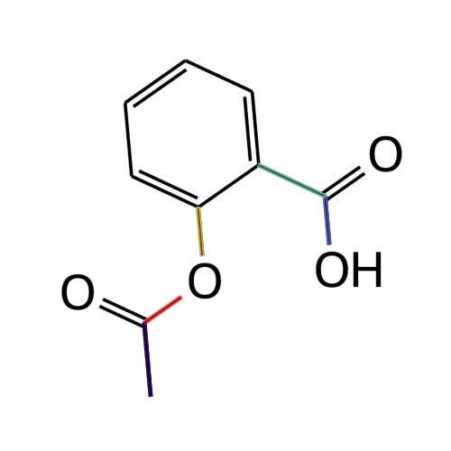
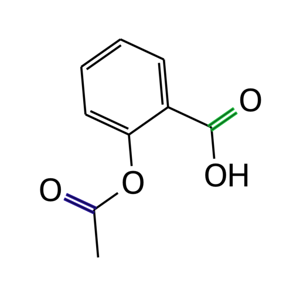
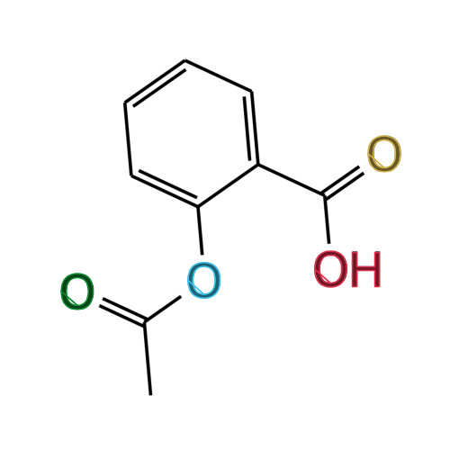
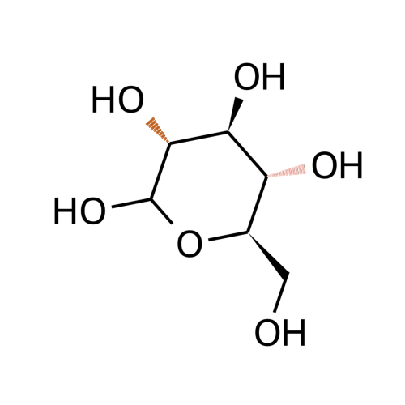
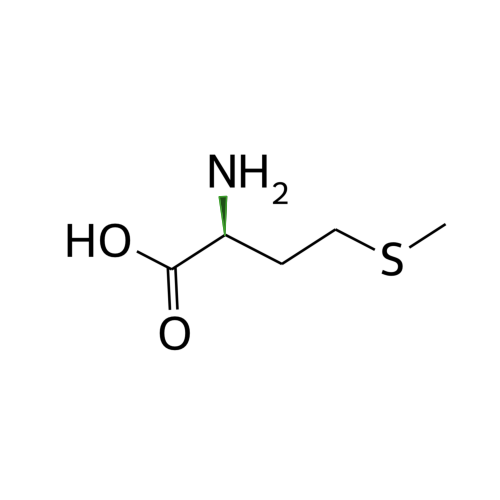
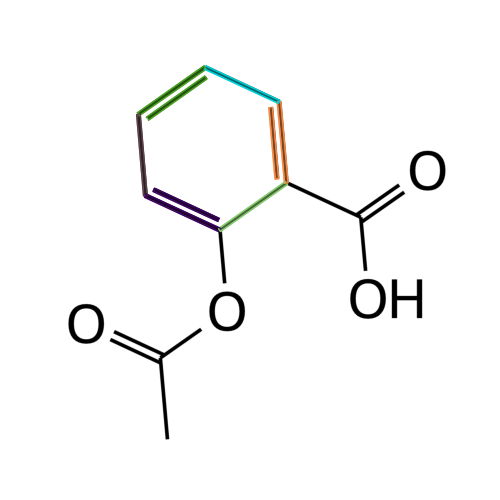
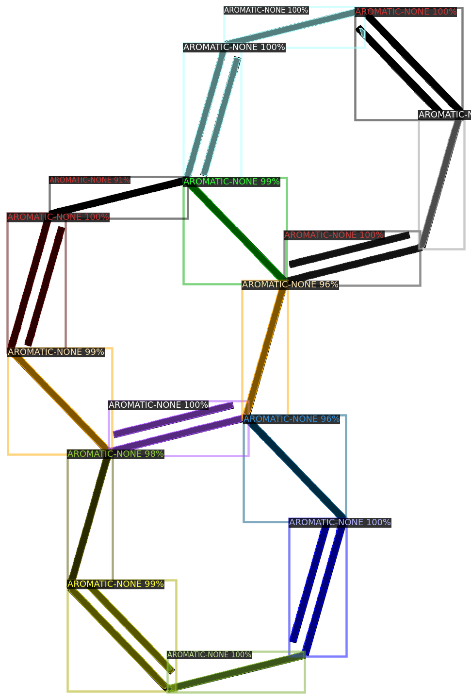
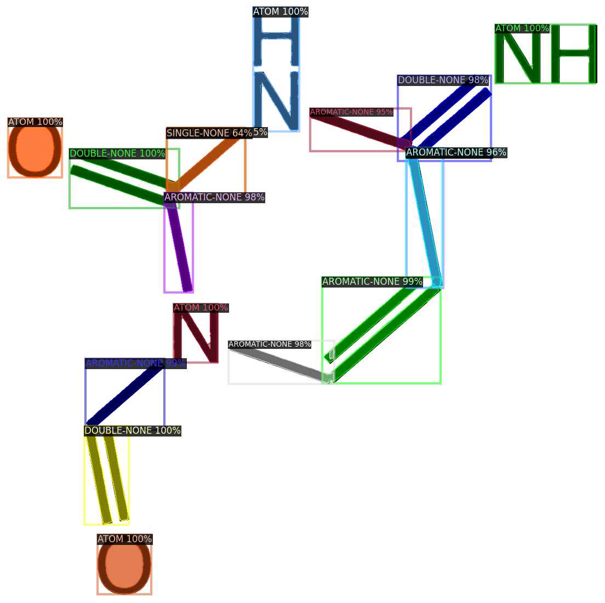

# SMILES Instance Segmentation


This project trains a deep learning model to perform instance segmentation on molecular structure diagrams, detecting and segmenting individual chemical bonds and atoms from rendered SMILES notation.

## 📌 Project Overview

The project consists of two main components:

1. **Synthetic Dataset Generation** - Generates a labeled dataset of molecular structure diagrams from SMILES notation with various rendering parameters (rotation, size, font, bond widths)
2. **Model Training and Inference** - Trains a PointRend Mask R-CNN model using Detectron2 to perform instance segmentation on molecular structures 


## 🚀 Installation & Usage

Ensure you have uv installed, then synchronize the environment:
```bash
uv sync
```

Generate a synthetic dataset:
```bash
uv run python rendering/generate_dataset.py
```

Train the segmentation model:
```bash
uv run python segmentation/train.py
```

Run predictions on unseen images:
```bash
uv run python segmentation/predict.py
```


## 🧪 Synthetic Dataset Generation

The main entry file is `rendering/generate_dataset.py`. 
To create a sample, the following steps are performed:

1. Choose a SMILES pattern and sample rendering options (e.g., line width, rotation)
2. Use RDKit to generate an SVG file
3. Flatten SVG path objects to polygons 
4. Crop and scale the image
5. Extract segmentation masks and class labels from the SVG
6. Convert the SVG to a PNG


Note that there are currently 6 classes:

- **SINGLE-NONE**: Single chemical bonds (plain lines)



- **DOUBLE-NONE**: Double chemical bonds, shown as two parallel lines



- **ATOM**: Individual atom symbols (e.g., C, O, N) 



- **SINGLE-BEGINDASH**: Single bonds rendered with dashed lines, indicating stereochemistry



- **SINGLE-BEGINWEDGE**: Single bonds rendered with a wedge, representing 3D orientation (out of plane)



- **AROMATIC-NONE**: Aromatic bonds, depicted as alternating single/double bonds




## 🧠 Model Training and Inference

The code for training and inference is located in the `segmentation` directory.
We utilize the Detectron2 library to train our model. 
Molecular diagrams present unique challenges compared to natural images, particularly regarding fine-line features and boundary precision.

**Key Findings**
- **Resolution matters**: Too small input sizes cause thin lines (like dashed wedge bonds) to disappear within the feature extraction backbone. Increasing the input resolution was critical for maintaining feature signal.
- **PointRend Enhancement**: We utilized the [PointRend](https://github.com/facebookresearch/detectron2/tree/main/projects/PointRend) module, which is an extension to Mask R-CNN that improves segmentation quality, especially at object boundaries. PointRend uses a point-based rendering approach that adaptively selects points to segment at a finer resolution, rather than processing all pixels equally. This is particularly beneficial for our molecular structures, as it produces significantly "crisper" segmentation boundaries for thin lines and small features like atom labels and bond annotations.


### Training Configuration

Many parameters influence training and the resulting model performance. The main configuration is defined in `segmentation/config.py` and includes:

- **Backbone**: ResNet50 with Feature Pyramid Network (FPN) - chosen because pretrained PointRend weights are available
- **Input Resolution**: 800-1024px (critical for preserving thin line features)
- **Batch Size**: 16 images per batch
- **Learning Rate**: 0.01 with warmup for 100 iterations, then reduced by 0.5 at steps 200, 500, 750
- **Training Duration**: 1000 iterations (~15 minutes on NVIDIA A100)

The YAML config files in `segmentation/configs/` define the model architecture:
- `pointrend_rcnn_R_50_FPN_3x_coco.yaml`: Main config inheriting from base configurations
- `Base-PointRend-RCNN-FPN.yaml`: PointRend-specific settings like point sampling strategy
- `Base-RCNN-FPN.yaml`: Base Mask R-CNN architecture with FPN

### Commands for Dataset Generation and Training

**Generate a synthetic dataset** (creates 5000 samples by default):
```bash
uv run python rendering/generate_dataset.py
```

**Train the model**:
```bash
uv run python segmentation/train.py
```

The training script will:
1. Register the dataset with an 80/20 train/validation split
2. Load pretrained PointRend weights from COCO
3. Train for 1000 iterations
4. Save checkpoints every 500 iterations
5. Save all outputs to `segmentation/output/<timestamp>/`

**Run inference on validation set**:
```bash
# First, update TRAINING_NAME in segmentation/predict.py with your training timestamp
uv run python segmentation/predict.py
```

This will generate predictions for the first 20 validation images and save visualizations to the `debug/` directory.
## 📝 Results and Limitations

The results look quite decent overall. Some example predictions can be seen inside the `images` directory.

**Example Predictions:**




**Limitations:**

1. **Overlapping Structures**: When multiple bonds or atoms overlap heavily, the model struggles to correctly separate instances




2. **Ground Truth Artifacts for 'O'**: Due to the way instance masks are extracted from SVG paths, there is an artifact in the masks for 'O' characters, resulting in a straight line from the left to the bottom edge.
The predictions, however, seem not to be affected by this.


3. **Small Dashed Wedge Features**: When the dashes of a dashed wedge bond (SINGLE-BEGINDASH) appear small in the rendered image, the model's predicted masks tend to be less accurate, often missing individual dashes or producing fragmented segmentations.


